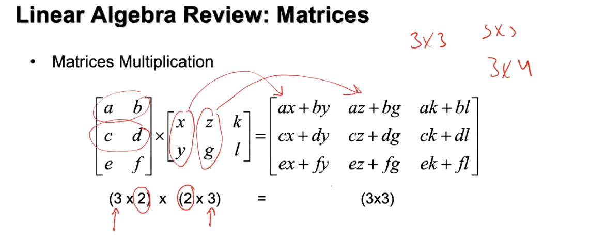

# Linear Algebra Review: Matrices
### Matrix Multiplication
- **Matrix Multiplication** is a binary operation that takes a pair of matrices, and produces another matrix.

**Example**
- Let's say we have two matrices A and B, and we want to multiply them.
- The product of A and B is denoted as AB.
- We can multiply A and B only if the number of columns in A is equal to the number of rows in B.
- If A is of shape (m x n) and B is of shape (n x p), then the product AB is of shape (m x p).

## Transpose of a Matrix
- The **transpose** of a matrix is a new matrix whose rows are the columns of the original.

**Example**
- Let's say we have a matrix A.
- The transpose of A is denoted as A^T.
- If A is of shape (m x n), then A^T is of shape (n x m).

